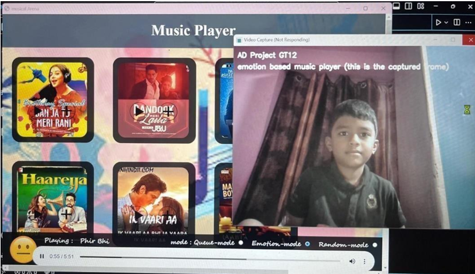

# 🎵 Emotion-Based Music Player

## 📌 Project Description

The Emotion-Based Music Player is an AI-powered application that detects a user's facial emotion in real-time using a webcam and recommends songs accordingly. This system uses Deep Learning and Computer Vision techniques to enhance user experience by providing personalized music suggestions based on mood.

---

## 🚀 Features

* 🎥 Real-time face detection using OpenCV
* 🤖 Emotion recognition using a trained CNN model
* 🎵 Music recommendation based on detected emotion
* 😊 Supports multiple emotions: Happy, Sad, Angry, Neutral, Surprise, Fear
* ⚡ Fast and responsive system

---

## 🛠️ Tech Stack

* **Programming Language:** Python
* **Libraries:** OpenCV, NumPy, Pandas
* **Deep Learning:** TensorFlow / Keras
* **Interface:** Streamlit (for UI)

---

## 📂 Project Structure

```
Emotion-Based-MusicPlayer/
│
├── models/                # Trained ML models
│   └── final_model.h5
│
├── data/                  # Dataset files
│   └── Emo_Movies_Songs.xlsx
│
├── src/                   # Source code
│   ├── capture.py
│   ├── display.py
│   ├── model.py
│   ├── train_model.py
│
├── notebooks/             # Jupyter notebooks
│   ├── Emotion_Detection.ipynb
│   └── Emotion_Model_RealTime_Tester.ipynb
│
├── haarcascade/           # Face detection model
│   └── haarcascade_frontalface_default.xml
│
├── screenshots/           # Output images
│   └── output.png
│
├── app.py                 # Streamlit UI
├── README.md
├── requirements.txt
```

---

## ▶️ How to Run the Project

### 🔹 Step 1: Clone the Repository

```
git clone https://github.com/Durgamvani-184/Emotion_Based_MusicPlayer.git
cd Emotion_Based_MusicPlayer
```

### 🔹 Step 2: Install Dependencies

```
pip install -r requirements.txt
```

### 🔹 Step 3: Run the Application

#### Option 1: Python Script

```
python src/capture.py
```

#### Option 2: Streamlit UI (Recommended)

```
streamlit run app.py
```

---

## 📊 Model Information

* **Model Type:** Convolutional Neural Network (CNN)
* **Dataset Used:** FER2013
* **Emotions Detected:** Angry, Disgust, Fear, Happy, Sad, Surprise, Neutral
* **Input Size:** 48x48 grayscale images

---

## 📸 Output



---

## 🎯 Future Improvements

* 🎧 Integration with Spotify API
* 📱 Mobile application version
* 🌐 Deployment on cloud (Streamlit / Render)
* 🎨 Improved UI/UX

---

## 👩‍💻 Author

**Durgam Vani**

---

## ⭐ Acknowledgements

* OpenCV for face detection
* TensorFlow/Keras for model building
* FER2013 dataset for training
